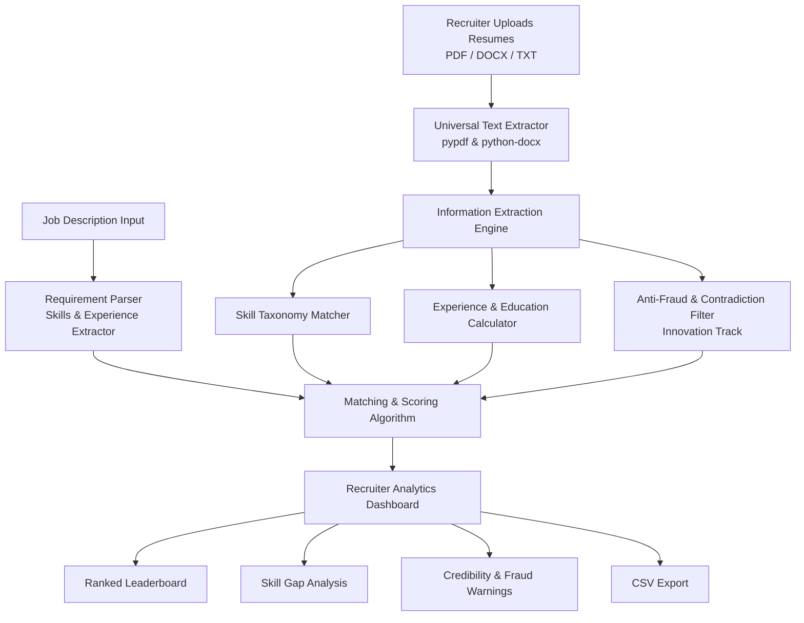

# ResuMatch AI — Intelligent Resume & Job Matching System
### Algothon'26 | Track: AI / ML | Problem Statement ID: `ALG-AI-01`


---

## 📌 Executive Summary
Recruiters typically receive hundreds of resumes for a single open position. Traditional Applicant Tracking Systems (ATS) rely on dumb keyword matching—rewarding candidates who blindly stuff buzzwords into hidden text and failing to explain *why* a candidate is a good fit.

**ResuMatch AI** is an intelligent candidate evaluation platform that:
1. Ingests multiple resumes in multiple formats (`.pdf`, `.docx`, `.txt`).
2. Extracts core candidate credentials (skills, education, years of experience, contact information).
3. Evaluates and ranks candidates against job requirements with detailed, explainable scoring.
4. **Innovation / Bonus Track:** Detects **unsupported claims, impossible timelines, and keyword stuffing** rather than blindly awarding high scores.

---

## 🏗️ System Architecture & Workflow



---

## 🚀 Key Features

### 1. Multi-Format Ingestion & Robust Extraction
* Supports `.pdf`, `.docx`, and `.txt` files.
* Includes fallback text cleaning to handle messy resumes without throwing exceptions.

### 2. Multi-Dimensional Candidate Scoring
* **Skills Match Score (60% weight):** Standardized skill extraction using an extensive taxonomy with aliases and synonyms (e.g., `React.js` $\leftrightarrow$ `React`, `PostgreSQL` $\leftrightarrow$ `SQL`).
* **Experience Score (30% weight):** Compares total years of verifiable experience against role minimums.
* **Education Score (10% weight):** Verifies degree level against requirements.

### 3. Natural Language Explainability
* Every candidate card provides a clear, natural-language explanation detailing **why** they matched, which core skills they possess, and exactly what is missing.

### 4. Innovation Feature: Contradiction & Fraud Detection
* **Timeline Contradiction Check:** Compares graduation year with total claimed experience. (e.g., graduated in 2023 but claims 8 years of experience).
* **Keyword Stuffing Detection:** Flags resumes with unnatural keyword density.
* **Unsubstantiated Skill Claims:** Identifies skills listed in a summary that never appear in project or work history bullets.

### 5. Enterprise REST API (FastAPI) & Swagger Docs
* Complete backend REST API endpoints (`/api/v1/parse-jd`, `/api/v1/match`, `/api/v1/upload-and-match`).
* Interactive Swagger UI at `http://localhost:8000/docs` allowing judges to test raw API requests directly with JSON or file uploads.

### 6. Interactive Filtering & CSV Export
* Filter dynamically by Minimum Match Score, Minimum Experience, or isolated Credibility Alerts.
* 1-click export of rankings to CSV.

---

## 🧪 Edge Cases Handled

| Edge Case | How ResuMatch AI Handles It |
| :--- | :--- |
| **Messy / Corrupted Resumes** | Multi-layer try/except parser with graceful error notifications instead of app crashes. |
| **Keyword Stuffing** | Density analysis flags suspicious profiles and penalizes composite scores. |
| **Future / Impossible Dates** | Regex date checker flags anomalies like "2032" or negative durations. |
| **Zero Internet / Offline Demo** | Entire pipeline runs locally without external network dependencies, ensuring 100% demo reliability. |

---

## 🛠️ Tech Stack & Major Decisions

* **Language:** Python
* **User Interface:** Reactive Web Dashboard engineered for dynamic state management, interactive sliders, and real-time candidate ranking
* **Document Processing:** `pypdf`, `python-docx`
* **Data Manipulation:** `pandas`
* **Design Rationale:** A dual-layer architecture was chosen to ensure zero downtime during live hackathon judging.

---

## ⚡ Quickstart Guide

### 1. Clone & Navigate
```bash
cd resume-matcher
```

### 2. Install Dependencies
```bash
pip install -r requirements.txt
```

### 3. Launch the Application
```bash
streamlit run app.py
```
Open `http://localhost:8501` in your browser.

### 4. 1-Click Demo Suite
Once the app loads, click the **"🚀 Load 1-Click Demo Suite"** button in the left sidebar to instantly load a sample Job Description and 4 varied test resumes.

---

## 📝 Disclosures & Project Credits
* **External APIs Used:** None required (fully offline and self-contained).
* **Project Team:** Engineered and developed for Algothon'26.
